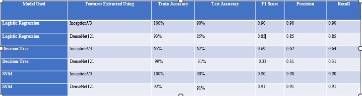

# SmartRecycle 
- Streamlit :
## Introduction
The lack of accessible tools for segregating waste and finding immediate recycling or reuse solutions leaves individuals unaware of simple steps they can take. Additionally, locating nearby drop-off points for waste types like organic, e-waste, and medical waste remains challenging. The absence of a platform that connects users with disposal facilities and provides instant reuse or recycling ideas inspired us to create a solution for better waste management practices.
### Objective
- Use Traditional ML models, Ensemble models and Deep Learning Models to classify waste images into categories like plastic, metal, or organic categories.
- Provide recycling suggestions, reuse ideas, and safe disposal methods for hazardous or non-recyclable waste.
- Suggest nearby recycling centers or drop-off points using geolocation and mapping tools.
## Research Questions
- Research Question 1: How can image classification models be optimized to accurately categorize waste into distinct categories for better waste management 
  practices?
- Research Question 2: How can location-based services and predictive models be integrated to suggest optimal waste disposal options based on user location and 
  waste type?
## Data Source
Data set has been downloaded from this URL titled "ImageNet" : https://www.image-net.org/index.php
- **Main categories chosen(Images)**
  1) *Wood*
  2) *cardboard*
  3) *e-waste*
  4) *glass*
  5) *medical*
  6) *metal*
  7) *paper*
  8) *plastic*
## Data Augmentation
- Performed data augmentation techniques on categories like Cardboard,medical,organic_waste,textiles,Wood for balancing the datasets
Image Counts by Category:
- cardboard: Main = 2332, Augmented = 410, Total = 2742
- plastic: Main = 2617, Augmented = 0, Total = 2617
- glass: Main = 2518, Augmented = 0, Total = 2518
- medical: Main = 1605, Augmented = 1088, Total = 2693
- paper: Main = 2749, Augmented = 0, Total = 2749
- e-waste: Main = 2405, Augmented = 0, Total = 2405
- organic_waste: Main = 277, Augmented = 2209, Total = 2486
- textiles: Main = 335, Augmented = 2155, Total = 2490
- metal: Main = 2259, Augmented = 0, Total = 2259
- Wood: Main = 347, Augmented = 2111, Total = 2458
  
## Machinelearning models Tackled with results

    
  
## Ensemble models Tackled

  
