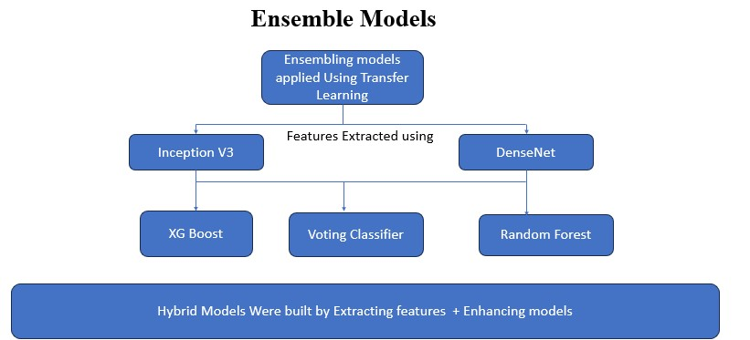
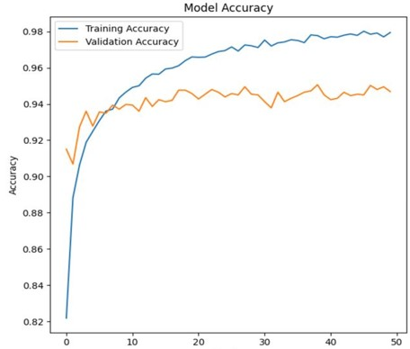
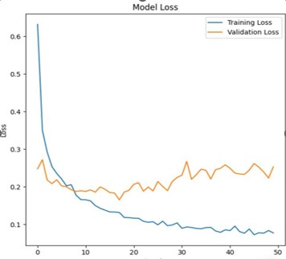

# SmartRecycle 

## Ever wondered how to reuse a waste item and where to dispose it quickly? Our app helps you to find the simpler ways to recycle and helps you to identify the nearest disposal centers,well if you live baltimore you can use our app and get ideas quickly

## Link to streamlit : https://smartrecycle.streamlit.app/ 

## Introduction
The lack of accessible tools for segregating waste and finding immediate recycling or reuse solutions leaves individuals unaware of simple steps they can take. Additionally, locating nearby drop-off points for waste types like organic, e-waste, and medical waste remains challenging. The absence of a platform that connects users with disposal facilities and provides instant reuse or recycling ideas inspired us to create a solution for better waste management practices.
### Objective
- ### 🎯 Objective of the Project

The objective of this project is to develop an AI-powered system that simplifies waste management by classifying waste images, providing personalized reuse or recycling recommendations, and guiding users to the nearest drop-off locations. It aims to reduce environmental impact, and make waste disposal more accessible and user-friendly.

## Research Questions
- Research Question 1: How can image classification models be optimized to accurately categorize waste into distinct categories for better waste management 
  practices?
- Research Question 2: How can location-based services and predictive models be integrated to suggest optimal waste disposal options based on user location and 
  waste type?
## Data Source
Data set has been downloaded from this URL titled "ImageNet" : https://www.image-net.org/index.php
- **Main categories chosen(Images)**
  1) *Wood*
  2) *cardboard*
  3) *e-waste*
  4) *glass*
  5) *medical*
  6) *metal*
  7) *paper*
  8) *plastic*
## Data Augmentation
- Performed data augmentation techniques on categories like Cardboard,medical,organic_waste,textiles,Wood for balancing the datasets
Image Counts by Category:
- cardboard: Main = 2332, Augmented = 410, Total = 2742
- plastic: Main = 2617, Augmented = 0, Total = 2617
- glass: Main = 2518, Augmented = 0, Total = 2518
- medical: Main = 1605, Augmented = 1088, Total = 2693
- paper: Main = 2749, Augmented = 0, Total = 2749
- e-waste: Main = 2405, Augmented = 0, Total = 2405
- organic_waste: Main = 277, Augmented = 2209, Total = 2486
- textiles: Main = 335, Augmented = 2155, Total = 2490
- metal: Main = 2259, Augmented = 0, Total = 2259
- Wood: Main = 347, Augmented = 2111, Total = 2458
  

## Model Performance: Traditional Machine Learning Models

| **Model Used**       | **Features Extracted Using** | **Train Accuracy** | **Test Accuracy** | **F1 Score** | **Precision** | **Recall** |
|-----------------------|------------------------------|---------------------|--------------------|--------------|---------------|------------|
| Logistic Regression   | InceptionV3                | 100%               | 90%                | 0.90         | 0.90          | 0.90       |
| Logistic Regression   | DenseNet121                | 93%                | 85%                | 0.85         | 0.85          | 0.85       |
| Decision Tree         | InceptionV3                | 65%                | 62%                | 0.69         | 0.62          | 0.64       |
| Decision Tree         | DenseNet121                | 99%                | 31%                | 0.33         | 0.31          | 0.31       |
| SVM                   | InceptionV3                | 100%               | 90%                | 0.90         | 0.90          | 0.90       |
| SVM                   | DenseNet121                | 92%                | 91%                | 0.91         | 0.91          | 0.91       |
 
  
## Ensemble models Tackled

  

## Model Performance: Ensemble Models

| **Model Used**       | **Features Extracted Using** | **Train Accuracy** | **Test Accuracy** | **Precision** | **Recall** | **F1 Score** |
|-----------------------|------------------------------|---------------------|--------------------|---------------|------------|--------------|
| Random Forest         | InceptionV3                | 91%                | 82%                | 0.84          | 0.82       | 0.82         |
| Random Forest         | DenseNet121                | 99%                | 72%                | 0.72          | 0.70       | 0.70         |
| XGBoost               | InceptionV3                | 100%               | 90%                | 0.90          | 0.90       | 0.90         |
| XGBoost               | DenseNet121                | 95%                | 87%                | 0.88          | 0.88       | 0.88         |
| AdaBoost              | InceptionV3                | 63%                | 62%                | 0.62          | 0.62       | 0.62         |
| AdaBoost              | DenseNet121                | 69%                | 67%                | 0.68          | 0.68       | 0.67         |

## Model Performance: Hybrid Models (SVM + XGBoost)

| **Model Used**       | **Features Extracted Using** | **Train Accuracy** | **Test Accuracy** | **Precision** | **Recall** | **F1 Score** |
|-----------------------|------------------------------|---------------------|--------------------|---------------|------------|--------------|
| SVM + XGBoost         | InceptionV3                | 99%                | 92%                | 0.92          | 0.92       | 0.92         |
| SVM + XGBoost         | DenseNet121                | 93.3%              | 92%                | 0.93          | 0.93       | 0.93         |

## Model Performance and Architecture Overview: Deep Learning Models

| **Model Used**       | **Overview of the Model**                                                                                                                                                                                                                       | **Train Accuracy** | **Test Accuracy** | **Precision** | **Recall** | **F1 Score** |
|-----------------------|------------------------------------------------------------------------------------------------------------------------------------------------------------------------------------------------------------------------------------------------|---------------------|--------------------|---------------|------------|--------------|
| **DenseNet**          | Input Layer: Receives images of size (244, 244, 3). Hidden Layers: The output of the DenseNet201 convolutional layers is passed through a GlobalAveragePooling2D layer to reduce spatial dimensions (224x224x3 → 1x1x1024). Then, it goes through a Dropout layer (rate 0.3) to prevent overfitting, followed by a Dense layer (num_classes neurons → softmax activation). Output Layer: Outputs a probability distribution with num_classes neurons using softmax activation for multi-class classification. | 89%                | 89%               | 0.89          | 0.89       | 0.89         |
| **Inception V3**      | Input Layer: The model receives images of size (299, 299, 3). Hidden Layers: The output from the InceptionV3 convolutional layers is passed through a GlobalAveragePooling2D layer to reduce spatial dimensions (from 299x299xchannels to a 1D vector). Next, a Dropout layer with a rate of 0.3 is applied to minimize overfitting, followed by a Dense layer with num_classes neurons and a softmax activation function. Output Layer: Produces a probability distribution across num_classes categories, using softmax activation for multi-class classification. | 95%                | 90%               | 0.95          | 0.95       | 0.95         |
| **ResNet**            | Input Layer: Receives images of size (224, 224, 3) and processes them through a series of residual blocks with skip connections to maintain information flow and support deeper learning. Feature Extraction: Uses a GlobalAveragePooling2D layer to compress spatial dimensions (e.g., 7x7x2048 → 1x1x2048) and a Dropout layer (rate 0.3) to minimize overfitting. Output Layer: A final Dense layer with num_classes neurons applies softmax activation to produce probabilities for multi-class classification, selecting the most likely waste category. | 99%                | 94%               | 0.94          | 0.94       | 0.94         |

From the above table we can conclude ResNet achieved the highest test accuracy (94%) and consistent metrics (Precision, Recall, and F1 Score: 0.94), making it the best overall model.

## 📈 Best Performing Model Results: ResNet

ResNet achieved the best performance among all tested models with **99% training accuracy** and **94% test accuracy**. Below are the detailed performance metrics and learning curves of the model:

#### **Performance Metrics**
- **Train Accuracy**: 99%
- **Test Accuracy**: 94%
- **Precision**: 0.94
- **Recall**: 0.94
- **F1 Score**: 0.94

#### **Learning Curves**
The following graphs illustrate the training and validation accuracy and loss over 50 epochs.

- **Model Accuracy**:
  - Training accuracy steadily improves and stabilizes around 98%-99%.
  - Validation accuracy remains consistently high at approximately 94%.

- **Model Loss**:
  - Training loss decreases sharply and stabilizes at very low levels.
  - Validation loss fluctuates slightly but remains low, demonstrating good generalization.

#### **Key Observations**
- ResNet’s residual connections helped the model learn effectively even with a deep architecture.
- The minimal gap between training and validation performance indicates low overfitting, making it suitable for waste classification tasks.

---

## 🎥 YouTube Recommendations for Reuse or Recycle

This feature provides personalized YouTube video suggestions to help users creatively reuse or properly recycle waste products based on the predicted waste category.

### **How It Works**
1. **Reuse Recommendations**:
   - Users receive the **top 3 YouTube videos** for creative reuse ideas (e.g., DIY crafts, upcycling projects) by entering keywords relevant to the waste type.

2. **Recycle Recommendations**:
   - Provides videos explaining proper recycling techniques specific to the waste category.

3. **Personalized Ranking**:
   - Video suggestions are ranked using **cosine similarity** or **Euclidean similarity**, ensuring the most relevant and practical recommendations for users.

## 📍 Overview of Drop-Off Locations & Data Preparation

This feature helps users find the nearest drop-off locations for waste disposal based on their zip code and the predicted waste category. The system uses a preloaded database of categorized drop-off locations and integrates with the **Google Maps API** to calculate the closest facility for the user.

### **How It Works**
1. **Categorized Database**:
   - Drop-off locations are pre-categorized based on waste types (e.g., e-waste, medical waste, recyclable items).
   - Data includes details like name, address, phone number, coordinates (latitude, longitude), and working hours.

2. **User Location Matching**:
   - Users provide their zip code, and the **Google Maps API** is used to convert the zip code into geographical coordinates.

3. **Nearest Location Calculation**:
   - Using **K-Nearest Neighbors (KNN)**, the system finds the closest drop-off facility that matches the waste category.

4. **Prepared Dataset**:
   - The dataset is stored in a CSV format and includes:
     - Drop-off facility name, address, and contact details.
     - Supported waste categories.
     - Coordinates for accurate location mapping.

## 🔮 Future Enhancements

### 1. Multi-Label Classification for Mixed Waste
The current model predicts a single category of waste. A future enhancement could involve implementing multi-label classification to identify multiple waste types in a single image. This will enable better handling of mixed materials, such as a plastic bottle with a paper label.

### 2. Collaborating with waste management offices
This product can be integrated with government waste management websites,
helping end-users access recycling and reuse ideas more effectively while promoting sustainable practices.

### 3. Expanding Geographic Coverage for Drop-Off Locations
Currently, drop-off location recommendations are region-specific(Baltimore). Expanding the database to include global locations will make the system more universally applicable, helping users worldwide to find the nearest waste disposal facilities.

## How to use the product?

- Upload single piece of waste and only a single image picture
- Click on either reuse,recycle or disposal
- Choose the mile radius of where to dispose

### Note : Only upload a single image category/piece of waste for the best results

